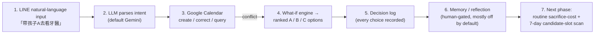
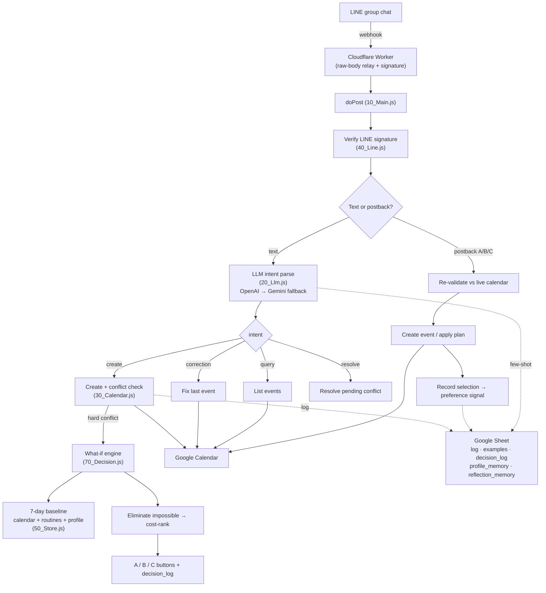

# Family Calendar AI Agent

> A LINE-based AI calendar agent that turns everyday family chat into Google
> Calendar events — and, when a new plan collides with the family's week, runs a
> **What-if** decision engine that proposes ranked A / B / C alternatives instead
> of just saying "that's taken."

Built on Google Apps Script. Natural-language understanding runs on an LLM
(provider-configurable — **default Gemini**; can be set to OpenAI-primary with
Gemini fallback); the decision logic that ranks alternatives is deterministic and
unit-tested.

> [!IMPORTANT]
> **This is an anonymized public showcase snapshot — not the live system.**
> - It is a read-only, cleaned snapshot for portfolio reading. The **private
>   development repository is the source of truth**; this public repo receives only
>   scanned, anonymized snapshots ([docs/PUBLIC_SNAPSHOT_POLICY.md](docs/PUBLIC_SNAPSHOT_POLICY.md)).
> - The **private dev environment, credentials, Script Properties, real resource
>   IDs, and deployment/relay setup are NOT included here.**
> - All family data in seed files, fixtures, and examples is **anonymized**
>   (`家長A` / `家長B` / `孩子A` / `孩子B`; generic districts `住家區` / `市區`).
> - This is **not** a complete autonomous learning system. Below, **Verified**,
>   **Partial**, and **Planned** features are listed separately.
> - **Production behavior cannot be fully verified from this public snapshot** —
>   live wiring, data, and runtime integration are validated privately.
>
> See [SECURITY.md](SECURITY.md) and [docs/PROJECT_STATUS.md](docs/PROJECT_STATUS.md).

---

## How it works (the pipeline, in 7 steps)



1. **LINE natural-language input** — you chat normally in a LINE group.
2. **LLM parses intent** — turns the message into `create` / `correction` /
   `query` / `resolve` (default provider Gemini).
3. **Google Calendar action** — creates, corrects, or queries events.
4. **What-if A / B / C** — on a conflict, a deterministic engine proposes ranked
   alternatives instead of just blocking you.
5. **Decision log** — every presented option and your pick is recorded.
6. **Memory / reflection** — exists and is wired, but deliberately conservative:
   most learning is human-gated and several surfaces are **off by default**.
7. **Next phase** — a routine *sacrifice / opportunity-cost* model and a full
   *7-day minimum-cost candidate-slot scan* (both **planned**, not built).

---

## What it does, in one minute

1. **You talk to it like a person, in a LINE chat.**
   "明天下午3點帶女兒去看牙醫" → it creates the calendar event, with a reminder.
2. **It understands follow-ups and corrections.**
   "不是明天，是週五" → it fixes the event you just made.
3. **It answers questions.**
   "這週六有空嗎？" → it reads the calendar and tells you.
4. **When a plan conflicts, it doesn't just block you — it helps you decide.**
   That's the **What-if engine** (below).

Everything happens inside a normal LINE group chat. There is no app to install.

---

## What-if: the part that makes it an *agent*, not a form

Most calendar bots do **conflict detection**: they check whether a new event
overlaps an existing one, and if so they say "conflict — yes/no?". This project
does that too (the simple path). But the interesting part is the **What-if
engine**, which is decision *support*, not just detection.

| | Plain conflict detection | What-if engine |
|---|---|---|
| Trigger | New event overlaps a calendar event | Hard conflict found, **or** user prefixes `What-if：` |
| What it considers | The two overlapping events | A **7-day baseline**: calendar events + recurring routines + family profile (who needs an adult, who works when) |
| What it produces | "Keep both / move / cancel?" | Several **ranked strategies** with a cost for each |
| How it answers | One yes/no question | Top-3 options as **A / B / C** buttons |
| Does it learn? | No | Logs every decision; when you pick a non-recommended option it's recorded as a **preference signal** |

### An anonymized What-if conversation

```
You:  What-if：這週三晚上七點，家長A帶孩子A去看牙醫一小時

Bot:  發現衝突，請選擇方案：
      A 推薦｜牙醫照原時間，週日家庭活動改到 16:00–17:00
      B｜牙醫改到另一日 週四 19:00–20:00
      C｜家長B請假處理 牙醫
      回覆 A、B 或 C
      [ A ] [ B ] [ C ]   ← tappable LINE buttons

You:  (taps A)

Bot:  已依方案加入行事曆：家長A帶孩子A去看牙醫
      6/24 (Wed) 19:00–20:00
      並移動測試事件：週日家庭活動
      完成後可回覆「有照方案」或「沒照方案，實際是…」，我會記錄回饋。
```

What happened under the hood:

- **A (recommended)** is a `MOVE_EVENT` strategy — keep the dentist at its
  requested time and shift a *movable* item out of the way. It wins because its
  cost (rearranging one movable item) is lower than the alternatives. *(Today the
  engine only **executes** a move on a designated `[WHATIF_TEST]` event as a safety
  guard; relocating real calendar events is planned, not yet executed.)*
- **B** is a `DATE_CHANGE` — same time, a free day later in the week.
- **C** is a `LEAVE` strategy — keep everything but have an adult take leave;
  costed higher because leave-hours are weighted heavily.

Options that are *impossible* (e.g. moving an immovable work/school block, or
leaving a child with no adult) are eliminated **before** ranking, so you only ever
see options that actually satisfy the family's hard constraints.

Full walkthrough: **[docs/WHAT_IF_ENGINE.md](docs/WHAT_IF_ENGINE.md)**.

---

## System architecture



Module-by-module detail: **[docs/ARCHITECTURE.md](docs/ARCHITECTURE.md)**.

---

## Feature status

Honest status. "Verified" means there is code **and** a test in `90_Tests.js`
exercising it (deterministic logic tests for the engine; integration tests for the
live I/O paths).

### ✅ Verified (code + test in `90_Tests.js`)

| Feature | Test |
|---|---|
| LLM intent parsing + provider fallback (default Gemini) | `testLlmFallback` |
| Time-overlap conflict detection | `testDetectTimeConflict` |
| What-if V1 engine: generate → eliminate → cost-rank | `testWhatIfScenario…`, `testWhatIfV1…` |
| Strategy types AS_PROPOSED / TIME_SHIFT / DATE_CHANGE / MOVE_EVENT / REASSIGN_OWNER / LEAVE | `testWhatIfV1GeneratesScoredVariableOptions` |
| Hard-constraint elimination (immovable move rejected) | `testWhatIfV1EliminatesImmovableDirectMove` |
| Preference boost breaks cost ties | `testWhatIfV1PreferenceBreaksCloseCostTie` |
| `create` routed through What-if **before** any calendar write (TC01 regression) | `testTc01CreateRoutesToWhatIfBeforeCalendarWrite` |
| Stale option rejected when the calendar changed (AS_PROPOSED) | `testRevalidateDecisionOptionRejectsChangedCalendar` |
| Top-3 compact A/B/C reply | `testDecisionReplyShowsOnlyThreeCompactOptions` |
| Profile alias learning / resolution | `testProfileAliasLearning`, `testResolvePersonAlias` |

Calendar **create** is exercised by a live **integration** test
(`testCreateCalendarEvent`); update/list are not directly tested.

### 🟢 Implemented (working code, not directly unit-tested)

| Feature | Note |
|---|---|
| LINE signature verification (byte-accurate HMAC) | `40_Line.js`; `testLineSignatureFunction` only generates a signature — it doesn't assert accept/reject |
| Person & buffer conflict detection | Implemented in `30_Calendar.js`; only time-overlap has an assertion |
| Natural-language conflict-resolution loop (pending state) | `10_Main.js` + CacheService |
| Correction of the last event ("不是明天是週五") | `10_Main.js` |
| LINE A / B / C postback **execution** | Re-validation covers the AS_PROPOSED option vs the live calendar; other options are validated structurally. **Move execution is currently restricted to designated `[WHATIF_TEST]` events** as a safety guard — real movable-event relocation is not yet executed (see What-if doc). |
| Few-shot example capture → human-gated reuse in prompt | `50_Store.js` mechanism; not directly unit-tested |
| Decision log written for every What-if | `50_Store.js`, `70_Decision.js` |

### 🟡 Partially implemented (module exists; integration or activation not fully validated in production)

| Feature | State |
|---|---|
| Profile memory (aliases / constraints / preferences) | Extracted on corrections; auto-activation gated behind flags; production validation pending |
| Reflexion memory (auto self-reflection after errors/corrections) | Full module; **off by default** (`REFLEXION_ENABLED=false`), not validated live |
| Decision-outcome learning (pick a non-recommended option → preference) | Writes `pending`/`disabled` memories that require human review before reuse |
| `update` / `delete` intents | Recognized by the LLM but handled by a "not implemented" stub |

### 🔭 Planned (not yet built)

- **Postback idempotency** (see Known risks).
- **Routine sacrifice / opportunity-cost model** — today the cost function is a
  simple weighted sum (`leaveHours×3 + rearranges + cascades×2`); it is not yet a
  real opportunity-cost model for which routine is "cheapest" to sacrifice.
- **Forward 7-day lowest-cost slot scan** — the engine proposes a handful of
  forward candidate slots, but a full "scan the next week for the minimum-cost
  open slot" is not complete.
- **External web research** — `80_Research.js` is a feature-flagged stub
  (`evidenceStatus: "not_implemented"`).
- **Reflection / memory production integration** — wiring exists; end-to-end
  validation against real household data is still required.

### ⚠️ Known risks

- **Duplicate postback → duplicate event.** A tapped A/B/C option is executed
  without an idempotency key, and re-execution isn't blocked, so a duplicated
  LINE postback delivery can create the event twice. **Known defect.**
- Every message triggers an LLM call (cost & latency).
- All conflict reasoning assumes one shared family calendar; person-level
  conflicts depend on the profile/alias data being correct.

This is a working prototype and personal portfolio piece — **not** a finished,
fully-autonomous learning system.

---

## Documentation map

| Doc | What's inside |
|---|---|
| [docs/ARCHITECTURE.md](docs/ARCHITECTURE.md) | Modules, request lifecycle, data stores |
| [docs/WHAT_IF_ENGINE.md](docs/WHAT_IF_ENGINE.md) | The decision pipeline, sequence diagram, what's done vs next |
| [docs/MEMORY_AND_LEARNING.md](docs/MEMORY_AND_LEARNING.md) | Every store/memory/reflection/decision-log module, input→output→when read |
| [docs/PROJECT_STATUS.md](docs/PROJECT_STATUS.md) | Verified vs partial vs planned, with the four open work items |
| [docs/PUBLIC_SNAPSHOT_POLICY.md](docs/PUBLIC_SNAPSHOT_POLICY.md) | How this public showcase relates to the private source of truth |
| [SECURITY.md](SECURITY.md) | Secret handling, anonymization, reporting |

---

## Setup

This is an Apps Script project managed with [`clasp`](https://github.com/google/clasp).

```bash
# 1. Clone, then point clasp at your own Apps Script project
cp .clasp.example.json .clasp.json     # then edit scriptId
clasp login
clasp push                              # uploads 00_Config.js … 90_Tests.js

# 2. (LINE webhooks need a raw, un-re-serialized body — a thin Cloudflare
#     Worker relays the raw body + X-Line-Signature to the Apps Script web app.)
```

> [!IMPORTANT]
> `doPost` does **not** accept LINE's webhook payload directly. It expects a
> wrapper JSON `{ "body": "<raw LINE body>", "signature": "<X-Line-Signature>" }`
> posted by a small relay (a Cloudflare Worker, in the original deployment) that
> forwards the **byte-exact** raw body so the HMAC signature still verifies. That
> relay is a separate component and is **not included in this repo**; you'll need
> to supply your own (any proxy that forwards the raw body + signature works).

### Script Properties (the only place secrets live)

Set these in **Apps Script → Project Settings → Script Properties**. Nothing is
hardcoded; `00_Config.js` reads them all at runtime.

| Property | Required | Example / default |
|---|---|---|
| `LINE_CHANNEL_ACCESS_TOKEN` | ✅ | *(from LINE Developers)* |
| `LINE_CHANNEL_SECRET` | ✅ | *(from LINE Developers)* |
| `GOOGLE_CALENDAR_ID` | ✅ | `your-calendar@group.calendar.google.com` |
| `GEMINI_API_KEY` | ✅* | *(Google AI Studio)* |
| `OPENAI_API_KEY` | ✅* | *(needed if `LLM_PROVIDER=openai`)* |
| `LLM_PROVIDER` | – | `gemini` (default) or `openai` |
| `WHAT_IF_ENABLED` | – | `true` (default) |
| `DECISION_LOG_ENABLED` | – | `true` (default) |
| `REFLEXION_ENABLED` | – | `false` (default) |
| `VERIFY_SIGNATURE` | – | `true` (default) |

\* At least one LLM key is required; with `LLM_PROVIDER=openai` and
`LLM_FALLBACK_ENABLED=true`, Gemini is used as fallback.

On first run the script auto-creates a Google Sheet (`家庭行事曆 learning_log`)
with the `log`, `examples`, `decision_log`, `profile_memory`,
`reflection_memory`, `family_profile`, and `routine_model` tabs.

---

## Roadmap

1. **Postback idempotency** — dedupe key per option so retried deliveries can't
   double-create.
2. **Opportunity-cost model** — rank *which* routine is cheapest to sacrifice,
   beyond the current weighted-sum cost.
3. **7-day minimum-cost slot scan** — full forward search for the cheapest open
   slot across the week.
4. **Reflection / memory production integration** — validate the learning loop
   end-to-end on live (non-seed) data.

---

## Tech stack

Google Apps Script (V8) · Google Calendar API · Google Sheets (as data store) ·
LINE Messaging API · OpenAI + Gemini · Cloudflare Worker (raw-body relay) · clasp.

## License

[MIT](LICENSE).
