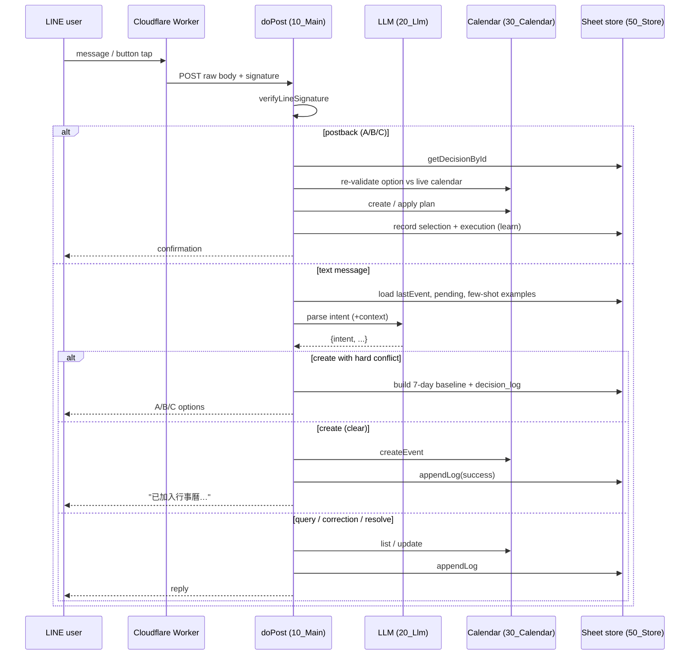

# Architecture

A LINE chat message becomes a Google Calendar action through a fixed pipeline:
**verify → parse intent → route → act → log → reply.** Natural-language
understanding is delegated to an LLM; everything that touches the calendar or
ranks decisions is deterministic code.

## Modules

The files are numbered so Apps Script loads them in dependency order. Each is a
single responsibility.

| File | Responsibility |
|---|---|
| `00_Config.js` | Reads all secrets/flags from Script Properties into `CONFIG`; defines `INTENTS` and log `STATUS` enums. **No secret is hardcoded.** |
| `10_Main.js` | `doPost` entry point, signature gate, intent router (`INTENT_HANDLERS`), all handlers, the conflict-resolution loop, and the postback handler. |
| `20_Llm.js` | NL → `{intent, event/range/resolution}` JSON. Builds the prompt (with profile, reflections, few-shot examples, pending-conflict context), calls the configured provider, validates the JSON. Default provider is **Gemini**; if `LLM_PROVIDER=openai`, OpenAI is primary and Gemini is the fallback. |
| `30_Calendar.js` | Google Calendar create/update/list, and conflict detection (time overlap, person clash, buffer violation). |
| `40_Line.js` | LINE signature verification (byte-accurate HMAC over the raw body), text replies, and A/B/C button (postback) replies. |
| `50_Store.js` | The data layer over a Google Sheet: `log`, `examples`, `reflection_memory`, `profile_memory`, `decision_log`, `family_profile`, `routine_model`. Also the pending-conflict cache and the What-if seed data. |
| `60_Reflexion.js` | Reflexion pattern: after an error/correction, optionally generate a one-line "next time" memory. Off by default. |
| `70_Decision.js` | **The What-if engine**: 7-day baseline, scenario generation, hard-constraint elimination, cost scoring, ranking, preference boost, decision-outcome learning, and the compact LINE reply. |
| `70_ProfileMemory.js` | Extracts stable household facts (identity / alias / relationship / constraint / preference); resolves a name/nickname to a canonical person; builds the family profile snapshot. |
| `80_Research.js` | Feature-flagged external-research interface. Currently a stub returning `not_implemented`; includes query anonymization. |
| `90_Tests.js` | Deterministic, runnable-in-Apps-Script test functions, including the What-if and TC01 regression cases. |

## Request lifecycle

### Why the Cloudflare Worker?

LINE computes the `X-Line-Signature` HMAC over the **exact raw request body**.
Apps Script web apps don't expose the untouched raw body reliably, and any
re-serialization breaks the signature (especially with multi-byte UTF-8). A thin
Worker forwards the raw body and signature verbatim; `verifyLineSignature` in
`40_Line.js` then computes the HMAC over bytes, not a re-encoded string.

## Data stores

All persistent state is a single auto-created Google Sheet (one tab per concern)
plus a short-lived cache entry for in-flight conflicts.

| Store | Backing | Lifetime | Purpose |
|---|---|---|---|
| `log` | Sheet | permanent | Every interaction: raw text, parsed JSON, final JSON, status, `relatedLogId` chain |
| `examples` | Sheet | permanent | Human-approved few-shot examples fed back into the prompt |
| `decision_log` | Sheet | permanent | Every What-if: options, recommendation, selection, outcome |
| `profile_memory` | Sheet | permanent | Aliases, constraints, preferences |
| `reflection_memory` | Sheet | permanent | Auto-generated "next time" rules (gated) |
| `family_profile` / `routine_model` | Sheet | permanent | Who the family is + recurring weekly routines (the What-if baseline) |
| pending conflict | CacheService | `PENDING_TTL_MINUTES` (15) | The "I asked you about a conflict and I'm waiting" state |

The full data-flow inventory — input, output, when written, when read, whether
it's wired into the main flow — is in
[MEMORY_AND_LEARNING.md](MEMORY_AND_LEARNING.md).

## Design principles

- **LLM proposes, deterministic code disposes.** The model classifies intent and
  (optionally) drafts scenarios, but elimination, costing, ranking, and every
  calendar write are deterministic and unit-tested.
- **Secrets only in Script Properties.** `00_Config.js` is the single read point;
  error messages run through `redactSecrets_` before logging.
- **Human-in-the-loop learning.** Auto-generated memories/examples land in a
  `pending`/`disabled` state and only influence prompts after a human enables
  them — one decision can't silently poison future behavior.
- **Fail soft.** The outermost `doPost` catch logs and replies with a safe
  message; reflection/memory failures are wrapped so they can never break a
  calendar action the user already completed.
