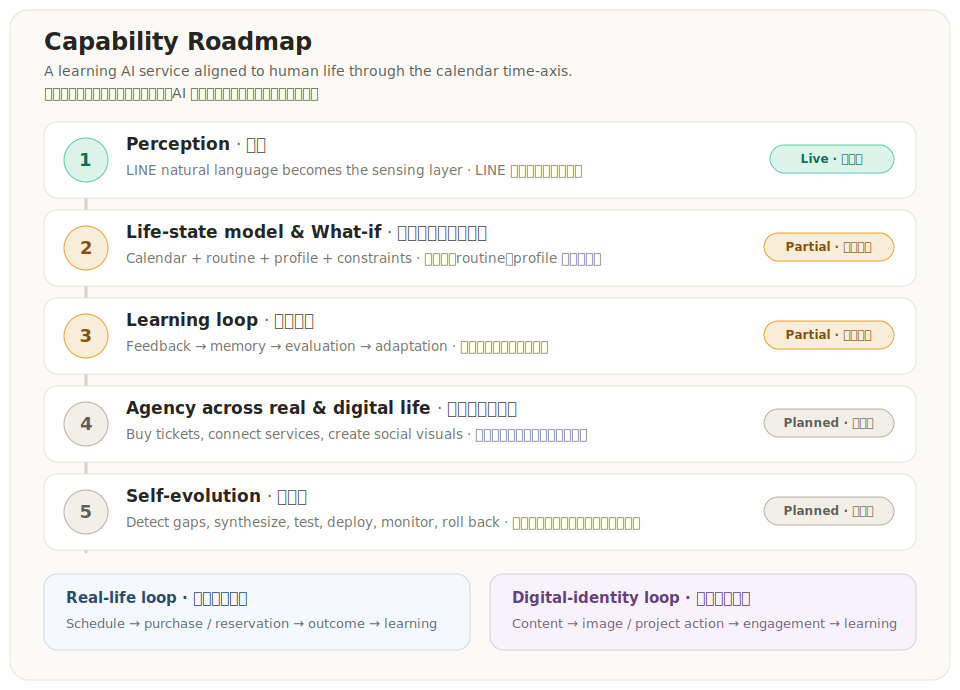
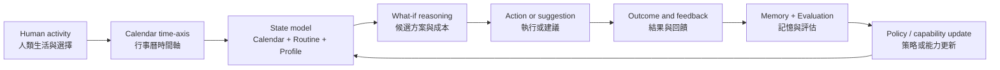
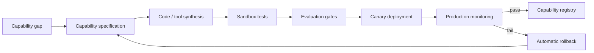

# Roadmap

> A living roadmap for a **learning AI service**. The calendar is not merely a scheduling interface; it is the time-axis that keeps human life, AI memory, decisions, actions, and learning aligned.
>
> 這是一份會持續演進的 roadmap，目標是建立一個**具有學習性的 AI 服務**。行事曆不只是排程介面，而是讓人類生活、AI 記憶、決策、行動與學習持續對齊的時間軸。

---

## 1. Thesis · 核心定位

**The calendar is the shared time-axis between human life and AI operation.**

A person keeps living: adding events, correcting details, rejecting suggestions, choosing alternatives, completing tasks, and changing routines. These actions form a continuous stream of time-grounded signals. The service uses that stream to update its state model, memory, evaluations, and future behavior.

**行事曆是人類生活與 AI 運作共同使用的時間軸。**

人類會持續生活：新增行程、修正資訊、拒絕建議、選擇替代方案、完成任務、改變 routine。這些行動形成一條帶有時間脈絡的連續訊號流。AI 服務以此更新狀態模型、記憶、評估結果與後續行為。

Scheduling is the first surface. The long-term product is a learning loop that aligns both the user's **real-life identity** and **digital identity** with AI-assisted operation.

排程只是第一個入口。長期產品是一個持續學習的閉環，讓使用者的**現實生活身分**與**數位身分**都能進入 AI 協作與持續學習。

---

## 2. Current baseline · 目前起點

Today, the project is a LINE-based AI calendar agent that:

- parses fuzzy natural language with an LLM;
- creates or queries Google Calendar events;
- detects schedule conflicts;
- generates deterministic What-if alternatives;
- records decisions and feedback signals;
- stores structured `routine model` and `profile memory` data in Google Sheets;
- contains memory and reflection modules that are not yet fully validated as an autonomous production learning loop.

目前專案是一個 LINE AI 行事曆代理，已具備：

- 使用 LLM 解析模糊的自然語言；
- 建立或查詢 Google Calendar 行程；
- 偵測時間衝突；
- 產生決定論式 What-if 替代方案；
- 記錄決策與回饋訊號；
- 在 Google Sheets 中保存結構化的 `routine model` 與 `profile memory`；
- 已有記憶與 reflection 模組，但尚未完整驗證為可自主運作的正式學習閉環。

Status labels used throughout this roadmap:

- **Live · 已實作** — implemented and supported by code or verified behavior.
- **Partial · 部分完成** — meaningful components exist, but the end-to-end capability is incomplete or not fully validated.
- **Planned · 規劃中** — target capability with no claim of current completion.

---

## 3. The learning loop · 學習閉環

The core of this project is not feature accumulation. It is the construction of a service that can learn over time while remaining grounded in the user's actual life.

這個專案的核心不是功能堆疊，而是建立一個能隨時間學習、同時仍與使用者真實生活對齊的服務。

A signal becomes learning only after it is captured, evaluated, and used to change future behavior. Therefore, the roadmap separates four layers:

1. **Signal capture** — events, edits, selections, corrections, outcomes.
2. **Memory** — structured and semantic representations of relevant history.
3. **Evaluation** — whether the suggestion or action was useful, correct, safe, and accepted.
4. **Adaptation** — updating ranking, policies, prompts, tools, or capabilities.

訊號必須被記錄、評估，並實際改變後續行為，才構成學習。因此本 roadmap 將學習拆成：訊號擷取、記憶、評估、調整四層。

---

## 4. Memory architecture · 記憶架構

### 4.1 Structured memory in Google Sheets · Google Sheets 結構化記憶

`routine model`, `profile memory`, examples, reflection records, and decision logs can be stored as structured rows in Google Sheets. This is already a practical memory substrate for a small household-scale system.

`routine model`、`profile memory`、examples、reflection 紀錄與 decision log 都可以使用 Google Sheets 的結構化欄列保存。對家庭規模的系統而言，這已經是一個可實際運作的記憶基底。

Status:

- Google Sheets storage for `routine model` and `profile memory`: **Live · 已實作**
- Automated retrieval and use across the complete learning loop: **Partial · 部分完成**
- Measured impact on future decisions: **Planned · 規劃中**

### 4.2 Can Google Sheets support vector search and RAG? · Google Sheets 能否支援向量檢索與 RAG？

**Yes — but a plain spreadsheet is not automatically a vector database or a RAG system.**

Google Sheets can serve as:

- the source of truth for text, metadata, profiles, routines, and decisions;
- a small-scale store for embedding vectors;
- a lightweight retrieval index when similarity is computed in Apps Script or another service;
- the content source that feeds a dedicated vector database later.

A vector/RAG path still needs:

1. content segmentation or record definition;
2. embedding generation;
3. vector storage;
4. similarity search and filtering;
5. retrieved-context injection into the LLM;
6. retrieval evaluation and access control.

**可以，但純粹把資料放進試算表，不會自動成為 vector database 或 RAG。** Google Sheets 可以保存 embedding 與 metadata，也可以在小規模下透過 Apps Script 或外部服務計算相似度。資料量、延遲與查詢需求提高後，再遷移到專用向量資料庫。

Status:

- Structured Sheets memory — storage **Live · 已實作**, retrieval & learning integration **Partial · 部分完成**
- Semantic retrieval / vector RAG: **Planned · 規劃中**

---

## 5. Capability arc · 能力成熟度軸

### 1. Perception · 感知 — `Live · 已實作`

LINE natural-language interaction becomes the sensing layer. The service turns everyday language into structured calendar intent.

LINE 自然語言互動成為感知層，把日常口語轉成結構化行事曆意圖。

### 2. Life-state model & What-if · 生活狀態模型與推演 — `Partial · 部分完成`

The system combines calendar events, routine model, profile memory, constraints, and decision logs. Current What-if logic detects conflicts, eliminates invalid options, ranks alternatives, and revalidates a selected option before execution.

系統逐步整合行事曆、routine model、profile memory、限制條件與決策紀錄。現有 What-if 已能偵測衝突、淘汰不可行方案、排序選項，並在執行前重新驗證。

Remaining work includes postback idempotency, a complete seven-day scan, and a more explicit routine-sacrifice cost model.

### 3. Learning loop · 學習迴圈 — `Partial · 部分完成`

Decision logs, examples, memory, and reflection provide the ingredients of learning. The next step is to turn them into a measured adaptation loop that changes future ranking, prompts, policies, or tool selection.

決策紀錄、examples、memory 與 reflection 已提供學習所需材料。下一步是讓這些資料真正改變後續排序、prompt、策略或工具選擇，並能被評估與回滾。

### 4. Agency across real and digital life · 現實與數位生活代理 — `Planned · 規劃中`

When scheduling and prediction reach their capability limit, the AI must act across both identities:

- **Real-life actions** — search availability, purchase tickets, make reservations, update the calendar, and record outcomes.
- **Digital-identity actions** — generate social-post images, prepare publishing assets, update online projects, and learn from digital engagement signals.

當排程與預測不足以完成目標時，AI 必須進入行動層：

- **現實身分**：查詢可用性、購票、預約、更新行事曆並記錄結果。
- **數位身分**：產生社群貼文圖片、準備發布素材、更新線上專案，並從數位互動訊號中學習。

These are not unrelated feature expansions. They are two output surfaces of the same learning loop: one acts in physical life, the other acts in digital life.

這不是無關功能的擴張，而是同一個學習閉環的兩個輸出面：一個作用於現實生活，一個作用於數位生活。

### 5. Self-evolution · 自演化 — `Planned · 規劃中`

The target is an architecture that can detect a capability gap, specify a new tool or module, synthesize code, test it, evaluate it, deploy it to production under machine-enforced policy, monitor the result, and roll back when necessary.

目標架構能偵測能力缺口、定義新工具或模組、自動合成程式碼、測試、評估，在機器可執行的治理規則下部署至正式系統，持續監控，必要時自動回滾。

This roadmap intentionally keeps automated production deployment as the destination. Governance is implemented as executable constraints, evaluation gates, canary releases, observability, and rollback — not as a denial of automation.

本 roadmap 明確保留「自動修改並部署正式系統」作為終點。治理的角色不是否定自動化，而是把限制、評估、灰度發布、監控與回滾寫成可執行機制。

---

## 6. Two connected operating loops · 兩個相連的運作閉環

### Real-life loop · 現實生活閉環

LINE request → calendar state → routine/profile context → What-if → ticket purchase or reservation → calendar update → outcome → learning.

### Digital-identity loop · 數位身分閉環

Project/content context → idea selection → social-post text/image generation → publishing workflow → engagement outcome → memory and learning.

Both loops share identity, time, memory, evaluation, and policy. The calendar remains the primary time-axis, while other services become action surfaces.

兩個閉環共享身分、時間、記憶、評估與策略。行事曆仍是主要時間軸，其他服務則成為行動輸出面。

---

## 7. Operable pillars · 可營運支柱

| Pillar · 支柱 | Role · 作用 | Current status · 現況 |
| --- | --- | --- |
| **Structured memory** | Calendar, routine, profile, examples, decisions | `Live` storage / `Partial` integration |
| **Semantic retrieval / RAG** | Retrieve relevant past context by meaning | `Planned` — embeddings and retrieval path required |
| **Monitoring & logs** | Evidence of behavior, failures, cost, and latency | `Partial` |
| **Evaluation** | Measure correctness, usefulness, safety, and learning gain | `Planned` |
| **Auth & identity** | Separate users, roles, permissions, and spending authority | `Planned` |
| **Idempotency & transaction safety** | Prevent duplicate events, purchases, and actions | `Partial` — known postback gap |
| **Deployment & rollback** | Safely release human-written or synthesized capabilities | `Planned` |
| **Data governance** | Consent, retention, access, deletion, and auditability | `Planned` |

---

## 8. Metrics · 量化

The roadmap needs metrics that prove both usefulness and learning. Lower human intervention alone is insufficient; the system must also remain correct and reversible.

本 roadmap 需要同時證明「有用」與「真的在學習」。人工介入下降不能單獨作為成功標準，還必須維持正確性、可追溯與可回滾。

### Candidate headline metrics · 候選頭條指標

- **Learning gain · 學習增益** — improvement in accepted-first-option rate and reduction in corrections for repeated contexts over time. `待埋點`
- **Verified autonomous completion · 可驗證自主完成率** — actions completed without correction, duplication, rollback, or policy violation. `待埋點`

### Supporting metric tree · 支援指標樹

- **Household value** — time saved, conflicts avoided, decision load reduced.
- **Decision quality** — first-option acceptance, correction rate, regret/undo rate.
- **Memory quality** — retrieval precision, stale-memory rate, profile/routine consistency.
- **Agent success** — reservation, purchase, publishing, and execution success rates.
- **System operations** — latency, cost, availability, failure recovery, duplicate-action rate.
- **Learning safety** — policy violations, rollback rate, and regression rate after adaptation.

All metrics are candidates until instrumentation and sufficient data exist.

所有指標在完成埋點並累積足夠資料前，都屬候選，而不是已達成的成果。

---

## 9. Now / Next / Later · 時間窗

| Window | Items |
| --- | --- |
| **Now · 現在** | LINE perception; Calendar integration; What-if V1; decision log; Google Sheets routine/profile memory; fix postback idempotency; consolidate memory/reflection modules; monitoring baseline. |
| **Next · 接下來** | Routine-sacrifice cost model; full 7-day candidate scan; learning loop on decision feedback; semantic retrieval/RAG; evaluation harness; auth and household identity. |
| **Later · 之後** | Ticket purchase and reservations; social-post image and digital-project actions; cross-domain agency; automated capability synthesis; policy-gated production deployment and rollback. |

---

## 10. Governance boundaries · 治理邊界

- **Public repository:** anonymized fixtures only. No credentials, private IDs, real family names, or real schedules.
- **Private runtime:** may use consented real-life data under access control, retention rules, and audit logs.
- **No over-claiming:** every capability remains labeled `Live`, `Partial`, or `Planned`.
- **Purchases are real roadmap actions:** require spending caps, frequency limits, idempotency keys, authorization scopes, evaluation checks, receipts, and audit logs.
- **Digital publishing actions:** require identity separation, content provenance, publishing scopes, and outcome tracking.
- **Self-evolution targets production deployment:** synthesized capabilities pass sandbox tests, evaluation thresholds, policy checks, canary rollout, monitoring, and automatic rollback. High-impact changes may require stronger authorization, but the architecture is not human-gated by default.

---

## 11. Roadmap principle · Roadmap 原則

This project does not claim to be enterprise-grade today. Its claim is more specific:

1. the calendar provides a credible time-axis for aligning AI with human life;
2. structured routine and profile memory already provide a state-model seed;
3. What-if decisions create evaluable feedback;
4. learning connects feedback to future behavior;
5. agency extends the loop into real and digital life;
6. self-evolution allows the architecture itself to become part of the learning system.

這個專案不主張現在已經是企業級完成品。它主張的是：以行事曆作為時間軸，以 routine/profile 作為狀態模型，以 What-if 產生可評估決策，再將學習、代理行動與自演化逐步接入同一個閉環。
