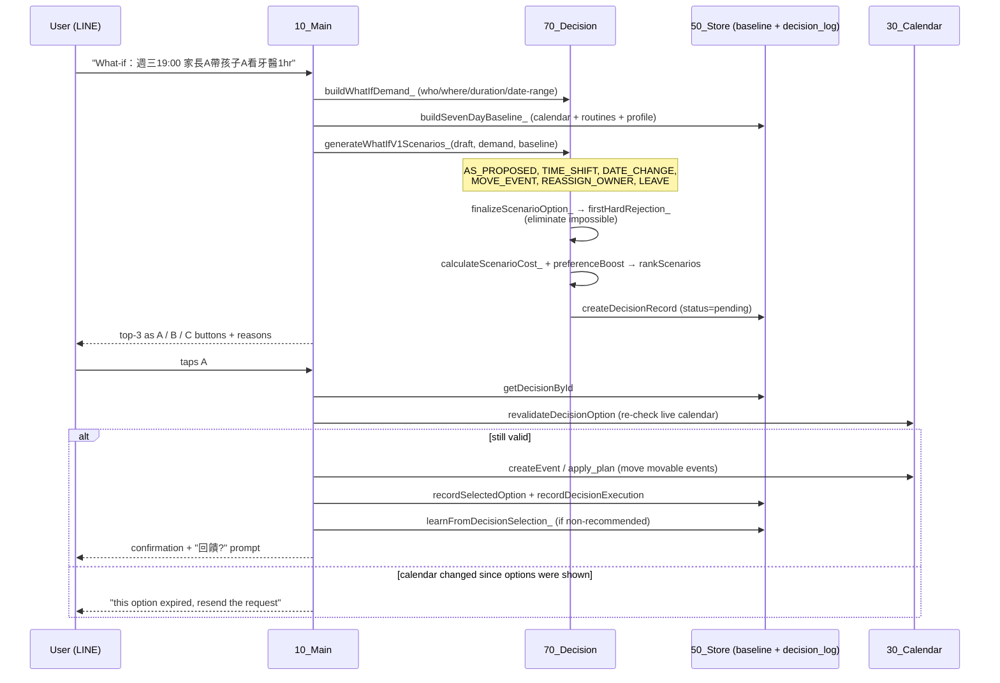

# The What-if Engine

The What-if engine is what turns this from a calendar *form* into a calendar
*agent*. When a new request collides with the family's week, it doesn't just
report the clash — it proposes ranked, executable alternatives and learns from
which one you pick.

It lives in `70_Decision.js`, with the baseline and decision log in `50_Store.js`
and the LINE buttons in `40_Line.js`. The deterministic V1 path
(`generateWhatIfV1Scenarios_`) is fully unit-tested; an optional LLM planner can
draft additional scenarios, but ranking and elimination are always deterministic.

## When it triggers

1. A `create` request is detected to have a **hard conflict** against the live
   calendar or the 7-day baseline (`10_Main.js` → `handleCreate_`), **or**
2. The user explicitly prefixes a message with `What-if：` / `what-if:` / `模擬：`
   (`parseWhatIfCommand_`), to explore alternatives even without a conflict.

## The pipeline



### 1. Capture the demand
`buildWhatIfDemand_` extracts required participants (by matching profile aliases
in the text), location, duration, and a 7-day date window from the drafted event.

### 2. Build the baseline
`buildSevenDayBaseline_` merges three sources over the next 7 days:
- **calendar events** (`listEvents`), each resolved to a person where possible;
- **routines** (`routine_model`) expanded per weekday — work, school, commute,
  care, family activities, each flagged `movable` or not;
- **family profile** — roles, who `requires_adult_companion`, work hours.

### 3. Generate candidate scenarios
Each generator emits one strategy *type* (capped per type):

| Type | Idea |
|---|---|
| `AS_PROPOSED` | Do exactly what was asked. |
| `TIME_SHIFT` | Same day, +1/+2/+3 hours. |
| `DATE_CHANGE` | Same time, a later day in the window. |
| `MOVE_EVENT` | Keep the request; move a **movable** existing event out of the way. |
| `REASSIGN_OWNER` | Assign a different available adult. |
| `LEAVE` | Keep everything; an adult takes leave to cover a work overlap. |

### 4. Eliminate the impossible (hard constraints)
`firstHardRejection_` rejects a scenario outright if it:
- moves an event that is **not** `movable`;
- drops a **required participant**;
- sends a child out with **no adult** (`requires_adult_companion`);
- produces a **final-schedule overlap** for the same person — including the same
  person being in two places at once, or colliding with work/school/care blocks —
  unless a `LEAVE` resolves the work overlap.

Only survivors continue. The user never sees an impossible option.

### 5. Cost + rank
`calculateScenarioCost_`:

```
total = leaveHours × 3  +  rearrangeCount  +  cascadeCount × 2
```

`preferenceBoostForOption_` then subtracts a boost when a scenario matches an
active stored preference (e.g. "prefer changing the date over taking leave"), and
`rankScenarios` sorts by adjusted score, then leave-hours, then number of affected
events, then option id — a fully deterministic, tie-broken order.
`limitRankedForLine_` dedupes by strategy and keeps the top 3 → **A / B / C**.

### 6. Decide, re-validate, execute
The three options become tappable LINE postback buttons (`40_Line.js`). Tapping
one re-runs `revalidateDecisionOption`: it re-checks the **proposed event** against
the live calendar and rejects a stale **AS_PROPOSED** option if the calendar now
conflicts (other strategy types are validated structurally — a fuller per-option
re-check with the *selected* option's new time is a known gap). If still valid, it
creates the event. For a `MOVE_EVENT`, the move is **executed only on designated
`[WHATIF_TEST]` events** (`updateCalendarTestEventOnly` refuses to touch anything
else) — a deliberate safety guard while real movable-event relocation is still on
the roadmap. The decision log is updated `selected` → `executed`.

### 7. Log + learn
Every What-if writes a `decision_log` row (options, recommendation, selection,
outcome). If the user picks a **non-recommended** option, `learnFromDecisionSelection_`
records a `pending`/`disabled` preference candidate for later human review — a
preference signal, not a parse error. A follow-up like "有照方案" / "沒照方案，實際是…"
is captured via `tryHandleDecisionFeedback_` and closes the loop.

## What's done vs. next

**Done (deterministic + tested):** demand capture, 7-day baseline merge, all six
scenario types, hard-constraint elimination, cost/preference ranking, A/B/C
buttons, stale-`AS_PROPOSED` re-validation, decision logging, and the
non-recommended-pick preference signal.

**Next:**

0. **Full per-option re-validation + real move execution.** Re-validation
   currently fully covers only the `AS_PROPOSED` option, and move execution is
   restricted to `[WHATIF_TEST]` events. Extend re-validation to each selected
   option's new schedule, and safely execute moves on real movable events.
1. **Routine opportunity-cost model.** The cost function is a weighted sum; it
   doesn't yet reason about *which* routine is genuinely cheapest to sacrifice
   (e.g. a one-off movable activity vs. a recurring care block of equal nominal
   cost). The goal is a real opportunity-cost estimate per routine.
2. **Full 7-day minimum-cost slot scan.** Today `candidateStartTimes_` proposes a
   handful of forward slots (+1/2/3h, then a few fixed times per later day). The
   next stage is an exhaustive forward search for the cheapest open slot across
   the whole week, honoring all hard constraints.
3. **Postback idempotency.** A retried button delivery can re-execute and create a
   duplicate event — to be fixed with an idempotency key per decision/option.
